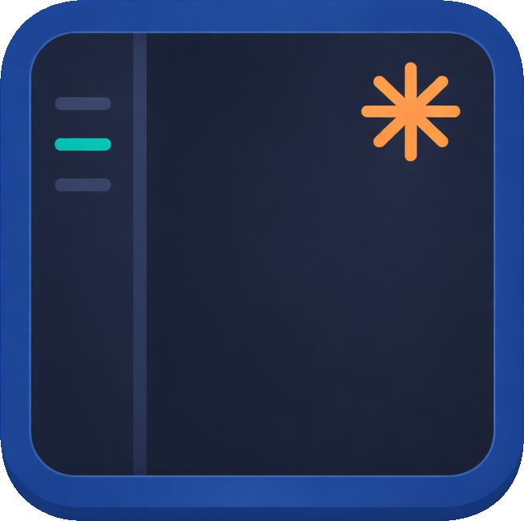

#  &nbsp; cc-deck

[](https://github.com/cc-deck/cc-deck/actions/workflows/ci.yaml)
[](https://codecov.io/gh/cc-deck/cc-deck)
[](https://go.dev)
[](https://www.rust-lang.org)
[](https://zellij.dev)
[](LICENSE)
[](https://github.com/cc-deck/cc-deck)

**The TweetDeck for Claude Code.** A [Zellij](https://zellij.dev) sidebar plugin that monitors, attends to, and orchestrates multiple Claude Code sessions from a single terminal view. Zellij is a modern terminal multiplexer (like tmux, but with a plugin system and built-in layout management).

> [!WARNING]
> **Beta Software.** cc-deck is under active development and not yet suitable for production use. APIs, configuration formats, and behavior may change between releases without notice. That said, the author uses it daily for real work, and it generally does what it promises. Bug reports and feedback are very welcome.

**[Website](https://cc-deck.github.io)** · **[Documentation](https://cc-deck.github.io/docs/)** · **[Quickstart](#install)** · **[Contributing](CONTRIBUTING.md)**

---

## What is cc-deck?

Managing multiple Claude Code sessions from separate terminals quickly becomes unwieldy. You lose track of which session is waiting for input, which one just finished, and which one needs your attention next.

cc-deck solves this with a real-time sidebar that shows all your sessions and intelligently directs your attention where it matters most.

### Zellij Sidebar Plugin

The sidebar plugin tracks every Claude Code session across tabs. It shows activity status, handles permission requests, and provides keyboard-driven navigation. Smart attend automatically cycles through sessions that need your attention, prioritizing permission requests over completed tasks over idle sessions.

### Unified Setup Command

The `cc-deck setup` command provides a single workflow for replicating your developer environment to both container images and remote SSH machines. A shared manifest captures your local tools, shell configuration, Claude Code plugins, and MCP servers. Two Claude Code slash commands handle the workflow:

- **`/cc-deck.capture`** discovers your local setup and writes it into the manifest
- **`/cc-deck.build --target container`** generates a Containerfile and builds an optimized image
- **`/cc-deck.build --target ssh`** generates Ansible playbooks and provisions a remote machine
- **`cc-deck setup run`** executes the generated artifacts directly (container build or Ansible playbook)

Capture once, then build for either target (or both) from the same manifest. After generating artifacts, run `cc-deck setup run` to execute them without Claude Code involvement. Use `--push` to also push container images to a registry.

### Network Filtering

When deploying containerized sessions, cc-deck can restrict outbound network access to only the domains your project needs. Domain groups (python, nodejs, rust, golang, github, and more) let you describe allowed domains by ecosystem instead of listing individual hosts. A tinyproxy sidecar enforces the allowlist in Podman deployments, while NetworkPolicy and EgressFirewall resources handle Kubernetes and OpenShift.

### Multi-Platform

Run cc-deck locally with Zellij or in Podman containers with mounted source code. Kubernetes support (Deployments and OpenShift) is planned. The sidebar experience is the same everywhere.

## Install

### Homebrew (macOS)

```bash
brew install cc-deck/tap/cc-deck
cc-deck plugin install
```

### Binary Download

Download the latest release from [GitHub Releases](https://github.com/cc-deck/cc-deck/releases):

```bash
# macOS (Apple Silicon)
curl -fsSL https://github.com/cc-deck/cc-deck/releases/latest/download/cc-deck_$(curl -s https://api.github.com/repos/cc-deck/cc-deck/releases/latest | jq -r .tag_name | sed 's/^v//')_darwin_arm64.tar.gz | tar -xz
sudo mv cc-deck /usr/local/bin/
cc-deck plugin install
```

### Linux Packages

```bash
# Fedora / RHEL
sudo dnf install ./cc-deck_*.rpm

# Debian / Ubuntu
sudo apt install ./cc-deck_*.deb
```

Download RPM and DEB packages from [GitHub Releases](https://github.com/cc-deck/cc-deck/releases). After installing, run `cc-deck plugin install` to set up the Zellij plugin and hooks.

### Demo Image (Try Without Installing)

```bash
podman run -it --rm \
  -e ANTHROPIC_API_KEY=sk-ant-... \
  quay.io/cc-deck/cc-deck-demo:latest
```

### Build from Source

```bash
git clone https://github.com/cc-deck/cc-deck.git
cd cc-deck
make install
```

Requires [Zellij](https://zellij.dev) 0.43+, [Go](https://go.dev) 1.22+, and [Rust](https://www.rust-lang.org) stable with `wasm32-wasip1` target.

## Usage

```bash
zellij --layout cc-deck
```

Or set as default in `~/.config/zellij/config.kdl`:

```kdl
default_layout "cc-deck"
```

## Layout Variants

Three layout styles are installed:

| Layout | Command | Description |
|--------|---------|-------------|
| `standard` | `zellij --layout cc-deck` | Sidebar + tab-bar + status-bar (default) |
| `minimal` | `zellij --layout cc-deck-minimal` | Sidebar + compact-bar |
| `clean` | `zellij --layout cc-deck-clean` | Sidebar only, no bars |

To change the default variant:

```bash
cc-deck plugin install --layout minimal --force
```

## Keyboard Shortcuts

### Global (from any tab)

| Key | Action |
|-----|--------|
| `Alt+s` | Open session list / cycle through sessions |
| `Alt+a` | Jump to next session needing attention |
| `Alt+w` | Jump to next working session |

### Session List (navigation mode)

| Key | Action |
|-----|--------|
| `j` / `↓` | Move cursor down |
| `k` / `↑` | Move cursor up |
| `Enter` | Switch to selected session |
| `Esc` | Cancel (return to original session) |
| `r` | Rename session |
| `d` | Delete session (with confirmation) |
| `p` | Pause/unpause session |
| `n` | New tab |
| `/` | Search/filter by name |
| `?` | Show keyboard help |

### Mouse

| Action | Effect |
|--------|--------|
| Left-click session | Switch to that session |
| Right-click session | Rename session |
| Click [+] | New tab |

## Customizing Keybindings

### Plugin Shortcuts (Alt+s, Alt+a)

Edit the plugin config in the layout file (`~/.config/zellij/layouts/cc-deck.kdl`):

```kdl
plugin location="file:~/.config/zellij/plugins/cc_deck.wasm" {
    mode "sidebar"
    navigate_key "Super s"    // default: "Alt s"
    attend_key "Super n"      // default: "Alt a"
    working_key "Alt w"       // default: "Alt w"
    done_timeout "300"        // seconds before Working→Done and Done→Idle (default: 300)
    idle_fade_secs "3600"     // idle indicator fade duration in seconds (default: 3600)
    auto_pause_secs "3600"    // auto-pause after idle for this many seconds (default: 3600, 0 to disable)
    attend_cycle_ms "2000"    // rapid-cycle window for attend/working in ms (default: 2000, 0 to disable)
}
```

Key syntax follows [Zellij key format](https://zellij.dev/documentation/keybindings.html): `Alt`, `Ctrl`, `Super` (Cmd on macOS), `Shift` as modifiers, followed by the key character.

After editing, restart Zellij to apply.

> **Note**: `make install` overwrites the managed layout files (`cc-deck.kdl`, `cc-deck-standard.kdl`, `cc-deck-clean.kdl`). Use a **personal layout file** to preserve custom keybindings across reinstalls.

### Personal Layout (Recommended)

Create a personal layout that won't be overwritten by `make install`:

```bash
cp ~/.config/zellij/layouts/cc-deck.kdl ~/.config/zellij/layouts/cc-deck-personal.kdl
```

Edit `~/.config/zellij/layouts/cc-deck-personal.kdl` and add your custom keys to the plugin blocks:

```kdl
plugin location="file:~/.config/zellij/plugins/cc_deck.wasm" {
    mode "sidebar"
    navigate_key "Super s"
    attend_key "Super n"
}
```

Then set it as default in `~/.config/zellij/config.kdl`:

```kdl
default_layout "cc-deck-personal"
```

Now `zellij` (without `--layout`) uses your personal keybindings automatically.

### Using Cmd Keys (macOS + Ghostty)

To use Cmd-based shortcuts, configure Ghostty to pass Cmd keys through to Zellij:

**Ghostty** (`~/.config/ghostty/config`):

```
keybind = cmd+s=unbind
keybind = cmd+n=unbind
```

## Session States

| Icon | State | Description |
|------|-------|-------------|
| ○ | Init | Session detected, Claude Code not yet producing output |
| ● | Working | Actively generating output or calling tools |
| ⚠ | Waiting (Permission) | Needs user permission to proceed (highest attend priority) |
| ⚠ | Waiting (Notification) | Paused with informational notification |
| ✓ | Done | Task completed (green, fades to grey over 5 minutes) |
| ✓ | Agent Done | Sub-agent completed |
| ○ | Idle | Running but waiting for user input (fades to dark grey over 1 hour) |
| ⏸︎ | Paused | Excluded from attend cycling, name dimmed |

### Session Lifecycle

Sessions progress through states automatically based on activity timeouts:

```
Working ──[5m idle]──> Done ──[5m]──> Idle ──[1h]──> Paused
```

- **Working to Done**: When no hook events arrive for 5 minutes, the session is considered complete. This acts as a fallback since Claude Code's `Stop` hook does not always fire on natural response completion.
- **Done to Idle**: After 5 more minutes, the green checkmark fades to a grey circle.
- **Idle to Paused**: After 1 hour of inactivity, the session auto-pauses. Paused sessions are excluded from attend cycling and hook processing.
- **Auto-unpause**: Switching to a paused session (via click, navigate, or attend) automatically unpauses it.

### Fading Indicators

Session indicators use time-aware color fading to show freshness at a glance:

- **Done** (✓): Fades from bright green to light grey over 5 minutes
- **Idle** (○): Fades from light grey to dark grey over 1 hour

The fade uses a square-root curve, so changes are most visible in the first few minutes and taper off gradually.

## Smart Attend (Alt+a)

Uses exclusive tiers. Only the highest non-empty tier is cycled:

1. **⚠ Waiting** (permission first, then notification, oldest first). When waiting sessions exist, Alt+a cycles ONLY among those.
2. **✓ Done** (most recently finished first). Only used when no waiting sessions exist.
3. **○ Idle/Init** (tab order). Only used when nothing else needs attention.
4. **Skips**: Working and Paused sessions are never attended.

Subsequent presses round-robin within the selected tier. If the current session is already the attend target, it skips to the next candidate.

## Working Jump (Alt+w)

Cycles through sessions that are actively running, ordered by most recently active first. Only Working sessions (purple `●`) are included. Waiting sessions are excluded since they need attention, which is Alt+a's job.

Rapid presses within 2 seconds cycle through all working sessions without revisiting. After a 2-second pause, the next press resets to the most recent working session.

## Network Filtering

Containerized sessions can be restricted to only the network domains your project needs, preventing code or secret exfiltration from YOLO-mode agents.

### Quick Setup

Add a `network` section to your `cc-deck-image.yaml`:

```yaml
network:
  allowed_domains:
    - github
    - python
    - golang
```

Then create a compose environment with network filtering:

```bash
cc-deck env create my-session --type compose --allowed-domains python,github
```

The session container is placed on an internal network with all traffic routed through a tinyproxy sidecar that only allows the specified domains.

### Domain Groups

Built-in groups cover common ecosystems. Run `cc-deck domains list` to see all available groups:

| Group | Covers |
|-------|--------|
| `python` | pypi.org, files.pythonhosted.org |
| `nodejs` | registry.npmjs.org, yarnpkg.com |
| `rust` | crates.io, static.crates.io |
| `golang` | proxy.golang.org, sum.golang.org |
| `github` | github.com, ghcr.io, githubusercontent.com |
| `gitlab` | gitlab.com, registry.gitlab.com |
| `docker` | registry-1.docker.io, auth.docker.io |
| `quay` | quay.io, cdn.quay.io |

Backend domains (Anthropic or Vertex AI) are included automatically.

### Customizing Domain Groups

Create `~/.config/cc-deck/domains.yaml` to extend or override built-in groups:

```bash
cc-deck domains init    # Seed config with commented built-in definitions
```

```yaml
# Extend built-in python group with internal registry
python:
  extends: builtin
  domains:
    - pypi.internal.corp

# Create a custom group
company:
  domains:
    - artifacts.internal.corp
    - git.internal.corp
```

### Create-Time Domain Overrides

```bash
# Specify domain groups when creating a compose environment
cc-deck env create my-session --type compose --allowed-domains rust,github

# Add or remove domains at runtime on a running session
cc-deck domains add my-session rust
cc-deck domains remove my-session docker
```

### Debugging Blocked Domains

```bash
cc-deck domains blocked my-session        # Show denied requests
cc-deck domains add my-session pypi.org   # Add domain at runtime
cc-deck domains show python               # Inspect a group's domains
```

## Environment Management

The `cc-deck env` command group provides a unified interface for managing Claude Code sessions across all supported backends (local, Podman, Kubernetes).

| Subcommand | Description |
|------------|-------------|
| `cc-deck env create` | Create a new environment (scaffolds definition if needed, then provisions) |
| `cc-deck env attach` | Attach to a running environment |
| `cc-deck env start` | Start a stopped environment |
| `cc-deck env stop` | Stop a running environment |
| `cc-deck env delete` | Delete an environment and its resources |
| `cc-deck env list` | List all environments (global and project-local) |
| `cc-deck env status` | Show detailed status of an environment |
| `cc-deck env prune` | Remove stale project registry entries |

### Project-Local Configuration

Environment definitions can live inside the project repository in a `.cc-deck/` directory at the git root. This allows team members to clone and create matching environments without manual flag passing.

```bash
# Set up a new project (scaffolds definition + provisions)
cc-deck env create --type compose --image quay.io/cc-deck/cc-deck-demo:latest
git add .cc-deck/ && git commit -m "Add cc-deck environment config"

# Team member clones and creates without any flags
git clone git@github.com:org/my-api.git && cd my-api
cc-deck env create     # reads .cc-deck/environment.yaml
cc-deck env attach     # no name needed inside the project
```

The `.cc-deck/` directory separates committed artifacts from runtime state:

```
.cc-deck/
  environment.yaml    # Committed: declarative definition
  .gitignore          # Committed: ignores status.yaml and run/
  image/              # Committed: build manifest, Containerfile
  status.yaml         # Gitignored: runtime state
  run/                # Gitignored: generated compose files
```

When no environment name is provided, `cc-deck` looks for `.cc-deck/environment.yaml` at the git root, then walks up the directory tree for workspace-level definitions. This supports both single-repo projects and multi-repo workspaces. All lifecycle commands (attach, status, start, stop, delete) support this implicit resolution.

### Compose Environments

Compose environments use `podman-compose` for multi-container orchestration. They generate runtime artifacts in `.cc-deck/run/` within the project directory.

```bash
# Create a compose environment in the current project
cc-deck env create --type compose

# Create with network filtering (proxy sidecar)
cc-deck env create --type compose --allowed-domains anthropic,github

# Attach to the environment
cc-deck env attach
```

The project directory is bind-mounted at `/workspace` by default, providing immediate bidirectional file sync.

### SSH Environments

SSH environments run Zellij sessions on persistent remote machines. You connect over SSH, work inside the remote Zellij session, and detach when finished. The session continues running on the remote host.

```bash
# Create an SSH environment
cc-deck env create remote-dev --type ssh --host user@dev.example.com

# Attach to the remote Zellij session
cc-deck attach remote-dev

# Refresh credentials without attaching
cc-deck env refresh-creds remote-dev

# Push files to the remote workspace
cc-deck env push remote-dev ./src
```

Pre-flight checks during creation verify SSH connectivity and offer to install missing tools (Zellij, Claude Code, cc-deck) on the remote.

### Variants

When the same project needs multiple isolated container instances (for example, per-worktree containers), use the `--variant` flag:

```bash
cc-deck env create --variant auth    # container: cc-deck-my-api-auth
cc-deck env create --variant bugfix  # container: cc-deck-my-api-bugfix
```

## Build from Source

```bash
# Prerequisites
rustup target add wasm32-wasip1
# Go 1.22+ required

# Build and install
make install
```

## Uninstall

```bash
cc-deck plugin remove
```

## Project Structure

```
cc-zellij-plugin/   Zellij sidebar plugin (Rust, WASM)
cc-deck/            CLI tool (Go)
docs/               Antora documentation source
demos/              Demo recording system
demo-image/         Demo container image build
base-image/         Base container image build
specs/              Feature specifications (SDD)
```

## Contributing

Contributions are welcome. See [CONTRIBUTING.md](CONTRIBUTING.md) for the development process, including how we use Spec-Driven Development for larger changes.

## Feature Specifications

cc-deck follows [Spec-Driven Development](CONTRIBUTING.md#spec-driven-development). Each feature starts with a specification before implementation. Current specs:

| ID | Feature | Status |
|----|---------|--------|
| [002](specs/002-cc-deck-k8s/) | Kubernetes CLI | Planned |
| [012](specs/012-sidebar-plugin/) | Sidebar Plugin | Implemented |
| [013](specs/013-keyboard-navigation/) | Keyboard Navigation & Global Shortcuts | Implemented |
| [014](specs/014-pause-and-help/) | Session Pause Mode & Keyboard Help | Implemented |
| [015](specs/015-session-save-restore/) | Session Save and Restore | Planned |
| [016](specs/016-k8s-integration-tests/) | K8s Integration Tests | Planned |
| [017](specs/017-base-image/) | Base Container Image | Implemented |
| [018](specs/018-build-manifest/) | Build Pipeline | In Progress |
| [019](specs/019-docs-landing-page/) | Documentation & Landing Page | In Progress |
| [020](specs/020-demo-recordings/) | Demo Recording System | In Progress |
| [021](specs/021-release-process/) | Release Process | Implemented |
| [022](specs/022-network-filtering/) | Network Security & Domain Filtering | In Progress |
| [023](specs/023-env-interface/) | Environment Interface and CLI | Planned |
| [024](specs/024-container-env/) | Container Environment | `podman run` lifecycle, definition/state separation, podman package | Implemented |
| [025](specs/025-sidebar-state-refresh/) | Sidebar State Refresh on Reattach | In Progress |
| [025](specs/025-compose-env/) | Compose Environment | Multi-container orchestration via `podman-compose`, optional network filtering | In Progress |
| [026](specs/026-project-local-config/) | Project-Local Config | `.cc-deck/` directory with shareable definitions, implicit name resolution, workspace support | Implemented |
| [027](specs/027-cli-restructuring/) | CLI Command Restructuring | Promote daily commands to top level, remove legacy K8s commands, organize help groups | In Progress |
| [030](specs/030-single-instance-arch/) | Single Instance Architecture | Controller + sidebar plugin split for scalable multi-tab performance | Implemented |
| [031](specs/031-single-binary-merge/) | Single Binary Merge | Merge controller + sidebar into one WASM binary with runtime mode selection | Implemented |
| [033](specs/033-ssh-environment/) | SSH Remote Execution | Remote Zellij sessions over SSH with pre-flight bootstrap, credential forwarding, and file sync | In Progress |
| [034](specs/034-unified-setup-command/) | Unified Setup Command | Single `cc-deck setup` command with shared manifest, Claude Code slash commands, and Ansible-based SSH provisioning | Planned |
| [036](specs/036-setup-run-command/) | Setup Run Command | `cc-deck setup run` executes pre-generated build artifacts (container build or Ansible playbook) directly from the CLI | Implemented |
| [037](specs/037-env-lifecycle-fixes/) | Environment Lifecycle Fixes | Fix type resolution for global definitions, SSH delete cleanup, SOURCE column in list, `--global`/`--local` flags | In Progress |
